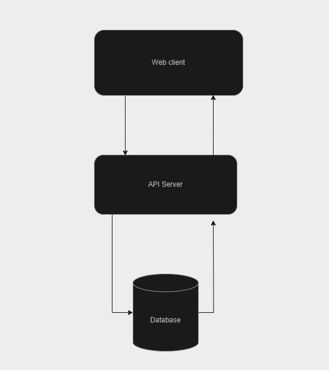

### Book store app

#### Overview
This is a Express API server to create, update, read, delete books datas.

#### Preparation
This project running on node v20.9.0 and Postgresql 16.
We are using yarn for package management so please follow this [Guide](https://classic.yarnpkg.com/lang/en/docs/install) to install yarn.
After install the prerequisites run the following command to install dependencies

```
yarn
```

Create `.env` file for the application. You can find list of environment variables in `.env.example` or list below
- `DATABASE_HOST`: Database host url
- `DATABASE_PORT`: Database port, usually 5432 for postgres
- `DATABASE_NAME`: Your database name
- `DATABASE_USERNAME`: Your postgresql username
- `DATABASE_PASSWORD`: Your postgresql password
- `ACCESS_TOKEN_SECRET`: Token for access token
- `REFRESH_TOKEN_SECRET`: Token for refresh token
- `NODE_ENV`: Your app environment, could be `development` or `production`

#### Run the app

To start app run
```
yarn start
```

To test run 
```
yarn test
```

##### Ensure all test cases are passed before pushing your code.

#### Folder Structure

- `routes`: Container all routes define for the api.
- `controllers`: Contain all controller to handle request, response
- `services`: Contain all logic like get data, filter data, update data, ...etc
- `middlewares`: Container all middlewares to handle request/response transformation before going to route.
- `error`: Custom error class to make it more clear for error handling
- `models`: Model define for database schema.

#### System diagram



#### API documentation
You can find documentation about the API on `localhost:3000/api-docs` when start development server or through [this link](https://resola-code.onrender.com/api-docs)

